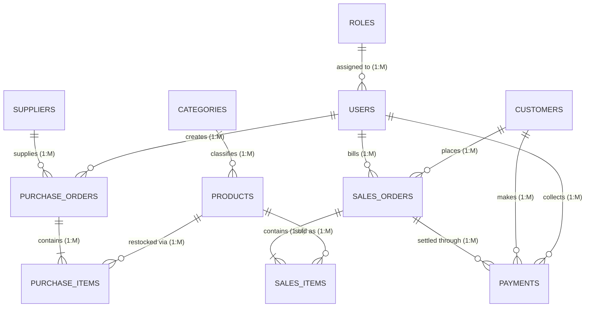

# SmartBiz – Centralized Retail & Inventory Management System
### A Complete Database Management System (DBMS) Project for B.Tech Computer Science & Engineering

---

## 1. Problem Statement & Motivation
Small retail and wholesale businesses often rely on fragmented paper registers, disorganized spreadsheets, or manual calculators to record sales, stock levels, and customer credit ledger balances ("Khata"). This manual approach leads to:
* **Inventory Mismatch & Stockouts**: Failure to track stock reductions upon sale or replenish below reorder levels.
* **Bad Debts & Uncollected Credit**: Inability to enforce customer credit limits or track partial payments.
* **Calculation & Tax Errors**: Inaccurate billing, discounts, or GST computations during peak hours.
* **Lack of Real-Time Analytics**: Store owners cannot easily determine which products produce high profit margins or identify dead stock.

**SmartBiz** solves these challenges by providing a centralized relational database management system that guarantees **ACID transactional integrity**, automated inventory adjustment via **triggers**, structured **views**, foreign key constraints, and real-time business reporting.

---

## 2. System Architecture & Tech Stack

```
SmartBiz Full-Stack Architecture
┌────────────────────────────────────────────────────────┐
│                   React + Vite UI                      │
│   (POS Billing, Inventory, Khata, Analytics, SQL Demo)  │
└─────────────────────────┬──────────────────────────────┘
                          │ REST API (JSON)
┌─────────────────────────▼──────────────────────────────┐
│                  Express.js Backend                    │
│   (Auth, Business Logic, Checkout ACID Transactions)   │
└─────────────────────────┬──────────────────────────────┘
                          │ SQL Queries & Triggers
┌─────────────────────────▼──────────────────────────────┐
│           Relational Database Engine (SQLite / MySQL)  │
│   (11 Tables, 3NF Normalization, Indexes, Views)       │
└────────────────────────────────────────────────────────┘
```

* **Frontend**: React 18, Vite, Lucide Icons, Custom Responsive CSS (Glassmorphism & Clean Typography).
* **Backend**: Node.js, Express.js (REST API layer with transactional boundaries).
* **Database Engine**: Relational SQL Engine (embedded `node:sqlite` for zero-install demonstration, plus full `database/schema.sql` compatible with MySQL 8.0+ and PostgreSQL).

---

## 3. Database Schema Design (Data Dictionary)

| # | Table Name | Primary Key | Foreign Keys | Key Constraints & Purpose |
|---|------------|-------------|--------------|---------------------------|
| 1 | `roles` | `role_id` | - | `UNIQUE(role_name)` — Role-based access control (ADMIN, CASHIER). |
| 2 | `users` | `user_id` | `role_id -> roles` | `UNIQUE(username)`, `UNIQUE(phone)` — Store operators and authentication. |
| 3 | `categories` | `category_id` | - | `UNIQUE(category_name)` — Classification of catalog items. |
| 4 | `suppliers` | `supplier_id` | - | `UNIQUE(phone)`, `UNIQUE(gstin)` — Vendor profiles for procurement. |
| 5 | `products` | `product_id` | `category_id -> categories` | `UNIQUE(sku_code)`, `CHECK(cost_price >= 0)`, `CHECK(selling_price >= cost_price)`, `CHECK(current_stock >= 0)`. |
| 6 | `customers` | `customer_id` | - | `UNIQUE(phone)`, `CHECK(outstanding_balance >= 0)` — Customer Khata ledger. |
| 7 | `purchase_orders`| `purchase_id` | `supplier_id -> suppliers`, `user_id -> users` | `CHECK(total_amount >= 0)` — Inward batch restock orders. |
| 8 | `purchase_items` | `purchase_item_id` | `purchase_id -> purchase_orders (CASCADE)`, `product_id -> products` | `CHECK(quantity > 0)`, `CHECK(unit_cost >= 0)` — Inward item details. |
| 9 | `sales_orders` | `order_id` | `customer_id -> customers (SET NULL)`, `cashier_id -> users` | `UNIQUE(invoice_number)`, `CHECK(net_payable >= 0)` — POS sales invoices. |
| 10 | `sales_items` | `sales_item_id` | `order_id -> sales_orders (CASCADE)`, `product_id -> products` | `CHECK(quantity > 0)`, `CHECK(line_total >= 0)` — Order line items. |
| 11 | `payments` | `payment_id` | `order_id -> sales_orders`, `customer_id -> customers`, `received_by -> users` | `CHECK(amount > 0)` — Tender settlements (CASH, UPI, CARD, CREDIT). |

---

## 4. Entity-Relationship (ER) Diagram



---

## 5. Database Normalization (Up to 3NF)

### First Normal Form (1NF):
* **Rule**: Every cell contains atomic (indivisible) values, and no repeating groups exist.
* **Application**: In a manual paper bill, multiple items are written in rows under one bill number. We normalized this by separating the invoice header (`sales_orders`) from the individual item entries (`sales_items`). Each row in `sales_items` represents a single product with an atomic quantity and unit price.

### Second Normal Form (2NF):
* **Rule**: Must be in 1NF, and all non-key attributes must be fully functionally dependent on the primary key (no partial dependencies on composite keys).
* **Application**: In `sales_items`, every attribute (`quantity`, `unit_price`, `line_total`) depends on the unique surrogate primary key `sales_item_id`. Descriptive product metadata (`product_name`, `category_id`, `cost_price`) is kept strictly in `products` rather than duplicating it inside `sales_items`.

### Third Normal Form (3NF):
* **Rule**: Must be in 2NF, and no transitive dependencies can exist (non-prime attributes must depend ONLY on candidate keys, i.e., $X \to Y$ where $Y$ is not transitively determined through another non-prime attribute).
* **Application**:
  * Product category information (`category_name`, `description`) is placed in `categories`, preventing `products.category_name` from transitively depending on `products.category_id`.
  * Supplier contact details (`contact_person`, `gstin`) reside in `suppliers`, not in `purchase_orders`.
  * Customer details (`full_name`, `phone`) reside in `customers`, not duplicated in `sales_orders`.

---

## 6. ACID Transactions & SQL Triggers

### 6.1 Atomic Checkout Transaction
When a customer purchases items at the POS counter, the system wraps all operations into a single atomic database transaction:
1. Verify available stock for each line item.
2. Verify customer credit limit if the sale is on credit (`DUE` or `PARTIAL`).
3. Generate unique invoice number and insert into `sales_orders`.
4. Insert line items into `sales_items` (which immediately fires Trigger 1).
5. Insert payment records into `payments`.
6. Update customer balance in `customers` if debt was incurred.
7. If any step fails (e.g., negative stock, exceeded credit limit), the transaction performs a **ROLLBACK**. Otherwise, it commits cleanly.

### 6.2 Database Triggers

#### Trigger 1: Deduct Stock After Sale
```sql
CREATE TRIGGER trg_deduct_stock_after_sale
AFTER INSERT ON sales_items
BEGIN
    UPDATE products
    SET current_stock = current_stock - NEW.quantity,
        updated_at = CURRENT_TIMESTAMP
    WHERE product_id = NEW.product_id;
END;
```

#### Trigger 2: Increment Stock After Supplier Restock
```sql
CREATE TRIGGER trg_add_stock_after_purchase
AFTER INSERT ON purchase_items
BEGIN
    UPDATE products
    SET current_stock = current_stock + NEW.quantity,
        updated_at = CURRENT_TIMESTAMP
    WHERE product_id = NEW.product_id;
END;
```

---

## 7. How to Run the Project Locally

### Prerequisites
* Node.js v18+ or v20+ or v24+ installed on your system.

### Step 1: Start the Backend Server
```bash
cd server
npm start
```
* The backend will start on **`http://localhost:5000`**.
* On first run, it automatically loads `database/schema.sql` and seeds realistic sample data from `database/seed_data.sql` into `database/smartbiz.db`.

### Step 2: Start the Frontend Client
Open a second terminal window:
```bash
cd client
npm run dev
```
* Open your browser and navigate to **`http://localhost:5173`**.

---

## 8. Academic Viva Questions & Answers (DBMS Examination Preparation)

### Q1: What is the primary key of `sales_items` and why not use composite key `(order_id, product_id)`?
**Answer**: While `(order_id, product_id)` is a valid candidate key, using a surrogate primary key `sales_item_id` provides simpler indexing, better performance with ORMs, and allows edge cases where a store might ring up the same SKU twice at different discounted rates in the same order.

### Q2: How does the system prevent selling items with insufficient stock?
**Answer**: Two-layer validation:
1. **Application / Transaction Layer**: Checks current stock against requested cart quantity inside the checkout transaction before inserting.
2. **Database Constraint Layer**: `CHECK (current_stock >= 0)` on the `products` table causes any transaction attempting to reduce stock below zero to abort immediately.

### Q3: What is the purpose of the `view_low_stock_products` SQL View?
**Answer**: A View provides **data abstraction and security**. It encapsulates the complex calculation `(reorder_level - current_stock)` and `JOIN` between `products` and `categories` into a reusable virtual table so that the inventory alert monitor can query it simply via `SELECT * FROM view_low_stock_products` without repetitive SQL logic.

### Q4: Explain the difference between `WHERE` and `HAVING` in your sales query.
**Answer**: 
* `WHERE` filters rows **before** aggregation takes place (e.g., `WHERE is_active = 1`).
* `HAVING` filters group rows **after** aggregation has occurred (e.g., `GROUP BY category_id HAVING SUM(line_total) >= 1000.00`).

### Q5: What happens if a customer is deleted while having past sales orders?
**Answer**: Foreign key constraint `ON DELETE SET NULL` on `sales_orders.customer_id` ensures that financial and tax transaction records remain intact for accounting integrity, while simply setting the customer reference to NULL.
